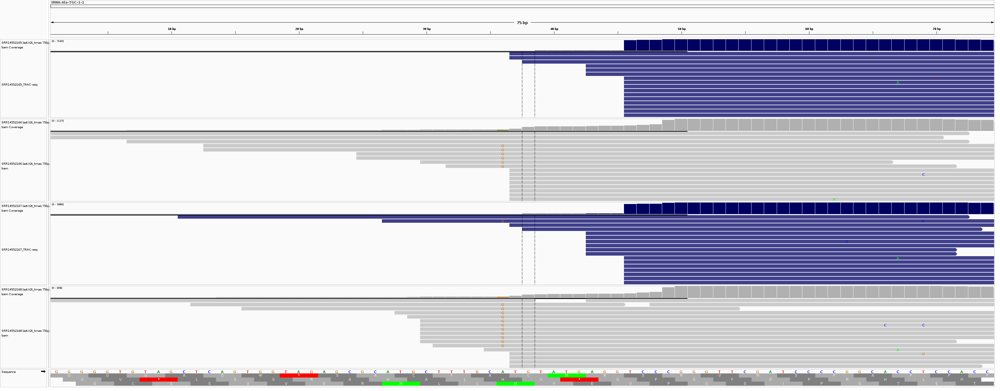
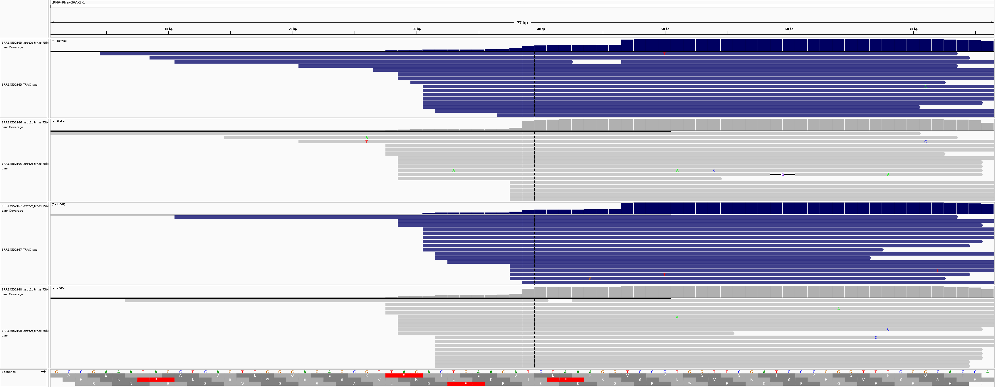
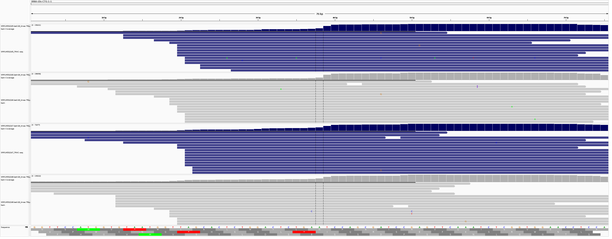

# external data used for comparison

## TRAC-Seq

### data

* human hepatocellular carcinoma cell line
* NextSeq 500 Illumina
* read length: 75bp

| run_name | type |
|---|---|
| SRR14552165 | small RNA-TRAC-Seq |
| SRR14552166 | small RNA-Seq |
| SRR14552167 | small RNA-TRAC-Seq |
| SRR14552168 | small RNA-Seq |

reference: 
Chen, Z., Zhu, W., Zhu, S., Sun, K., Liao, J., Liu, H., ... & Lin, S. (2021). METTL1 promotes hepatocarcinogenesis via m7G tRNA modification‐dependent translation control. Clinical and translational medicine, 11(12), e661.

### mapping 

We used the same procedure for mapping as with Bo-Seq data set. Despite that the read lengths from Chen et al. are longer and that they use different chemistry the coverage of 5-primes of selected tRNAs is also low, both when mapping small RNA untreated or TRAC-seq reads. TRAC-Seq in blue.

* Ala-TGC-1-1

 

* Phe-GAA-1-1

* Gln-CTG-1-1 (not methylated)

  