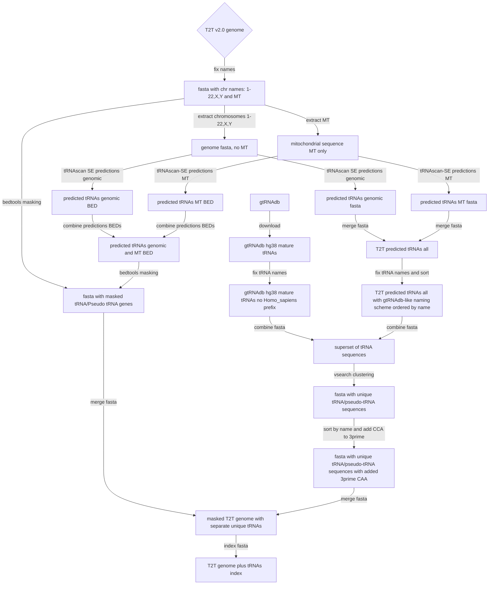
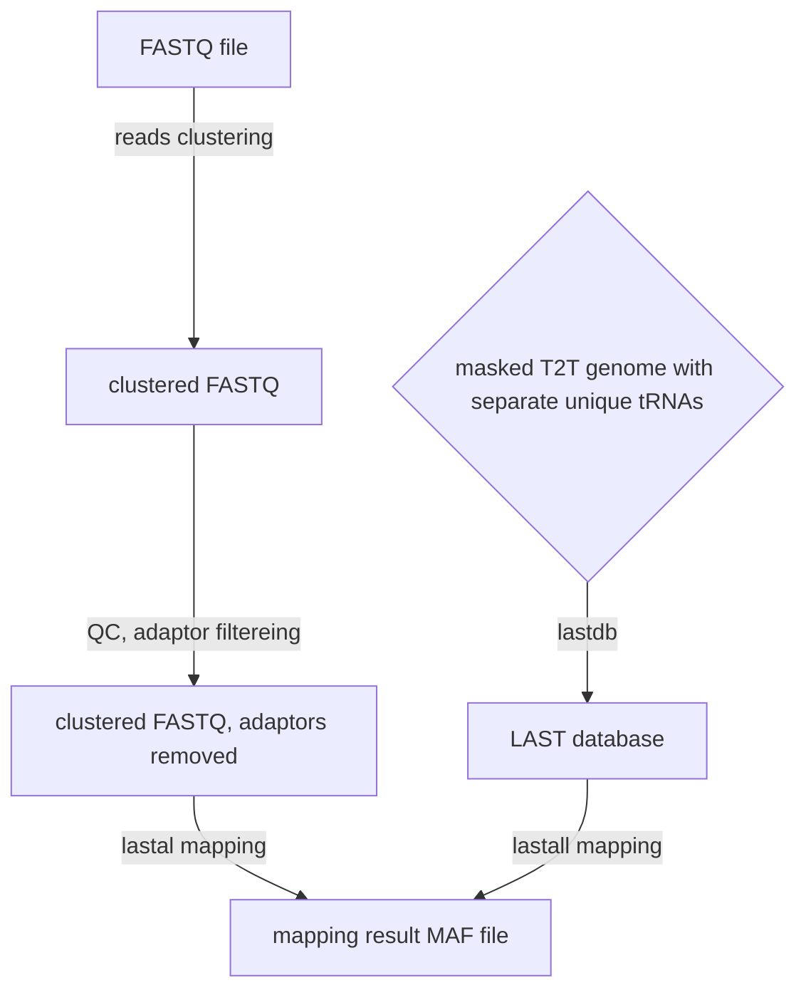

# bioinformatics workflow


## genome and tRNAs for mapping

We use T2T v2.0 genomic sequence to predict tRNAs using tRNAscan-SE. Predicted tRNAs are masked in the genomic sequence. 
Since the predictions do not provide us with information about tRNA splicing, we combine our predicted tRNA sequences with mature tRNAs from gtRNAdb.
Identical (100% identity) sequences are removed using vsearch.
To increase size of mappable tRNA sequences we add CCA to the 3 prime ends of all tRNAs in the set.  
Finally we combine  T2T contigs with masked tRNAs with the above super set of mature and predicted unique tRNA sequences.


## FASTQ mapping

We use the constructed as described above artificial genome to map short RNA NGS sequences. Reads in the input FASTQ files are clustered by sequence, then pre-processed using ```fastp```
removing adaptor sequences. 
Mapping is done using a strict mapper (```LAST```). Only the top hits are retained.




## parsing mappings

```
    unique_trnas_seq-->|ripgrep,sed|unique_trnas_seq_names[text file with unique by sequence tRNAs names]
    unique_trnas_seq_names-->|ripgrep, maf_2_fa_with_counts.py|trna_matches_with_counts[fasta with fastq-derived tRNA seq matches with counts] 
    maf_result-->|ripgrep, maf_2_fa_with_counts.py|trna_matches_with_counts
    gtRNAdb{gtRNAdb aligment}-->|download|html_aligment[html page with human tRNA aligments]
    html_aligment-->|ripgrep, tab_gtrna_to_stockholm.py|stockholm_align[text file with human tRNAs aligments in Stockholm format]
    stockholm_align-->|Infernal tools|cmscan_files[files for cmscan searches]
    cmscan_files-->|cmscan|cmscan_mapping_result[tabular mapping results]
    trna_matches_with_counts-->|cmscan|cmscan_mapping_result
    cmscan_mapping_result-->|top hits selection|cmscan_top_hits[TSV file with top hits and their positions]
    cmscan_top_hits-->|normalize coverage and plot|heat_maps[heat maps]
    fastq{fastq input} -->|clumpify| clumped_fastq(fastq minus optical replicates, clustered reads)
    clumped_fastq -->|fastp| clumped_fastped_fastq[fastq minus low complexity reads]
    clumped_fastped_fastq -->|fqgrep, batch_fqgrep.py script|clumped_fastped_masked_fastq[fastq with masked primer sequences]
    
```