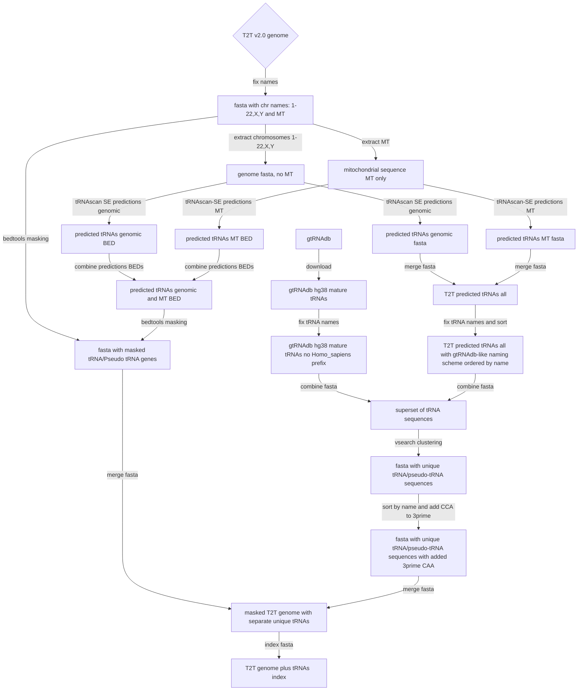
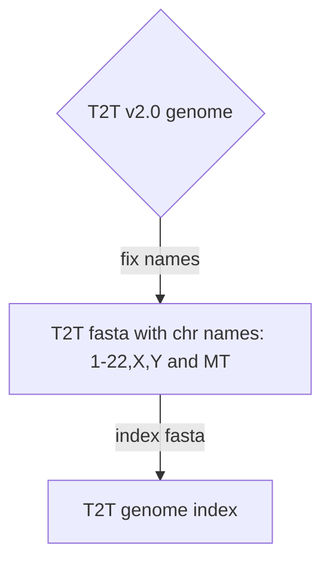
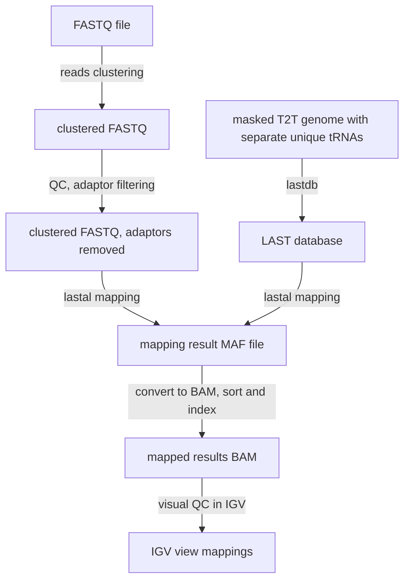
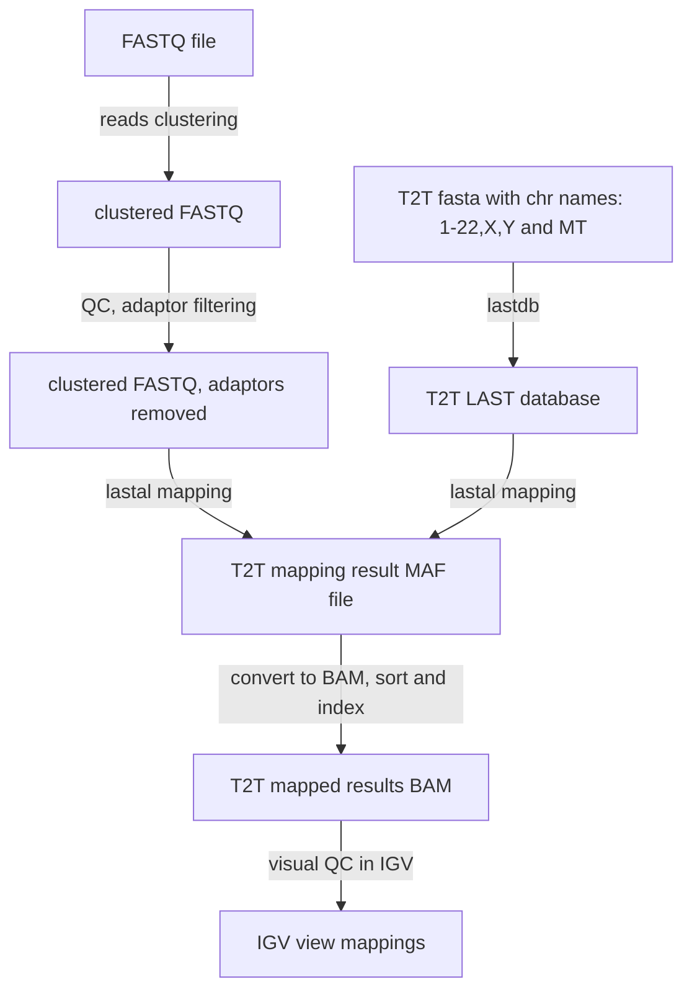
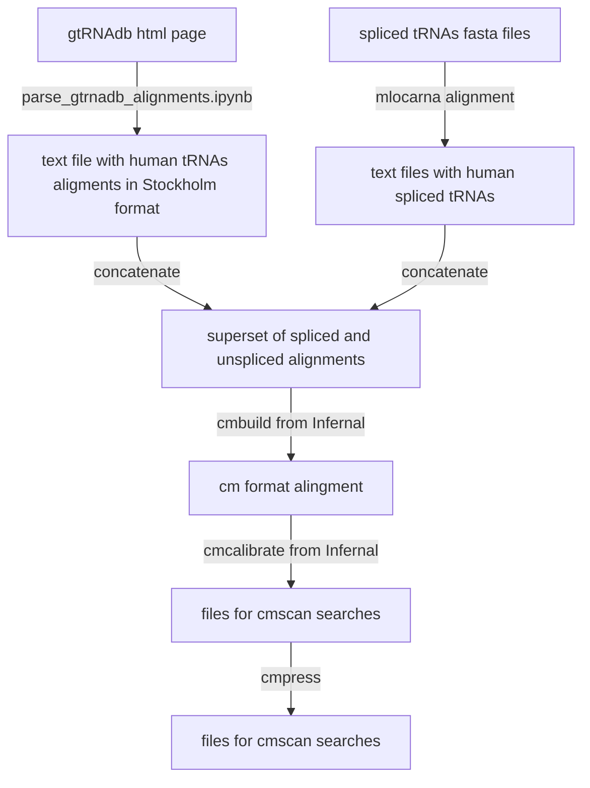
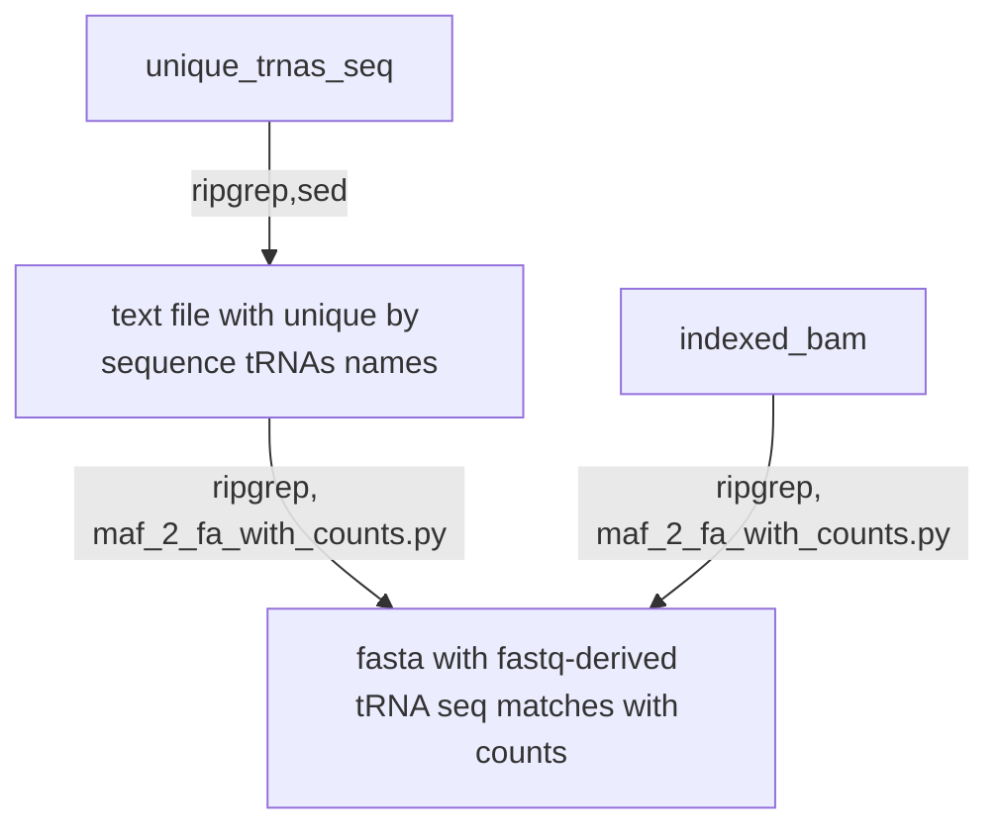
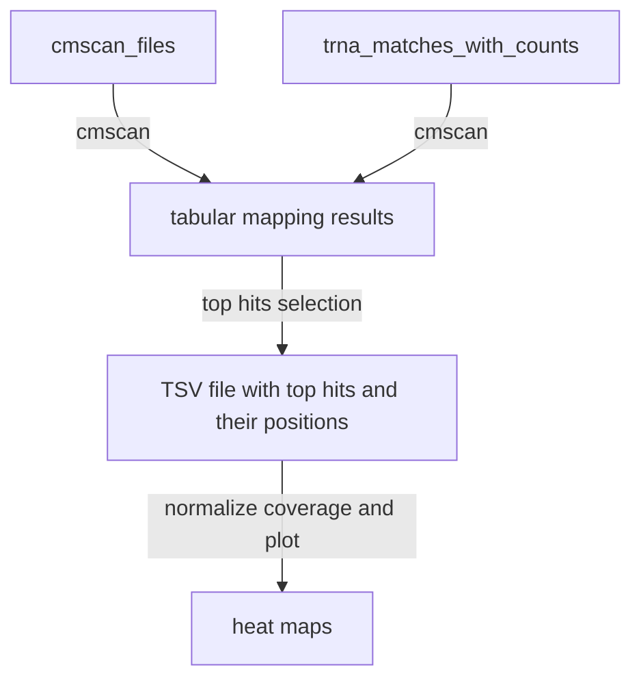

# bioinformatics workflow

## overview

To filter out not fully processed tRNA sequences we map FASTQ reads twice: 
1. to a constructed genome with unique tRNA added as separate contigs
2. to a regular human genome

We extract read sequences mapping to tRNA contigs from *1* and filter out reads overlapping the tRNAs genomic flanks as determined by mapping *2*. 

## genome and tRNAs for mapping

To filter out not fully processed tRNA sequences we map FASTQ reads twice: 
* to a constructed genome with unique tRNA added as separate contigs
* to a regular human genome


### constructed genome

We use T2T v2.0 genomic sequence to predict tRNAs using ```tRNAscan-SE```. Predicted tRNAs are masked in the genomic sequence. 
We extract both spliced and non-spliced tRNA sequences predicted by ```tRNAscan-SE``` and combine these with mature tRNAs from gtRNAdb.
Identical (100% identity) sequences are removed using vsearch.
To increase size of mappable tRNA sequences we add CCA to the 3 prime ends of all tRNAs in the set.  
Finally we combine  T2T contigs with masked tRNAs with the above super set of mature and predicted unique tRNA sequences.



### human genome




## FASTQ mapping

We use the constructed as described above artificial genome to map short RNA NGS sequences. Reads in the input FASTQ files are clustered by sequence, then pre-processed using ```fastp```
removing adaptor sequences. 
Mapping is done using a strict mapper (```LAST```). Only the top hits are retained.

### constructed genome



### human genome



# preparing tRNA isoforms aligments for cmscan

The primary source of the alignments is a HTML page from gtRNAdb (hg38 tRNAs). Aligments for the spliced tRNAs (tRNA-Arg-TCT
tRNA-Ile-TAT, tRNA-Leu-CAA, tRNA-Tyr-ATA, tRNA-Tyr-GTA) were created using mlocarna from LocaRNA.



## parsing NGS mappings

Objective: extract mappings to mature non-mitochondrial, non-psedogenes tRNAs.

Since short fragment reads can map to often nearly tRNA sequences we filter out reads mapping to pseudogenes/MT tRNAs to obtain reliable read assigments.  
Reads with mapping quality (MAPQ) zero are also dropped.

FIXME
use: bam_2_trna_reads_counts_fasta.py



## getting mapping positions using Infernal

FIXME 
