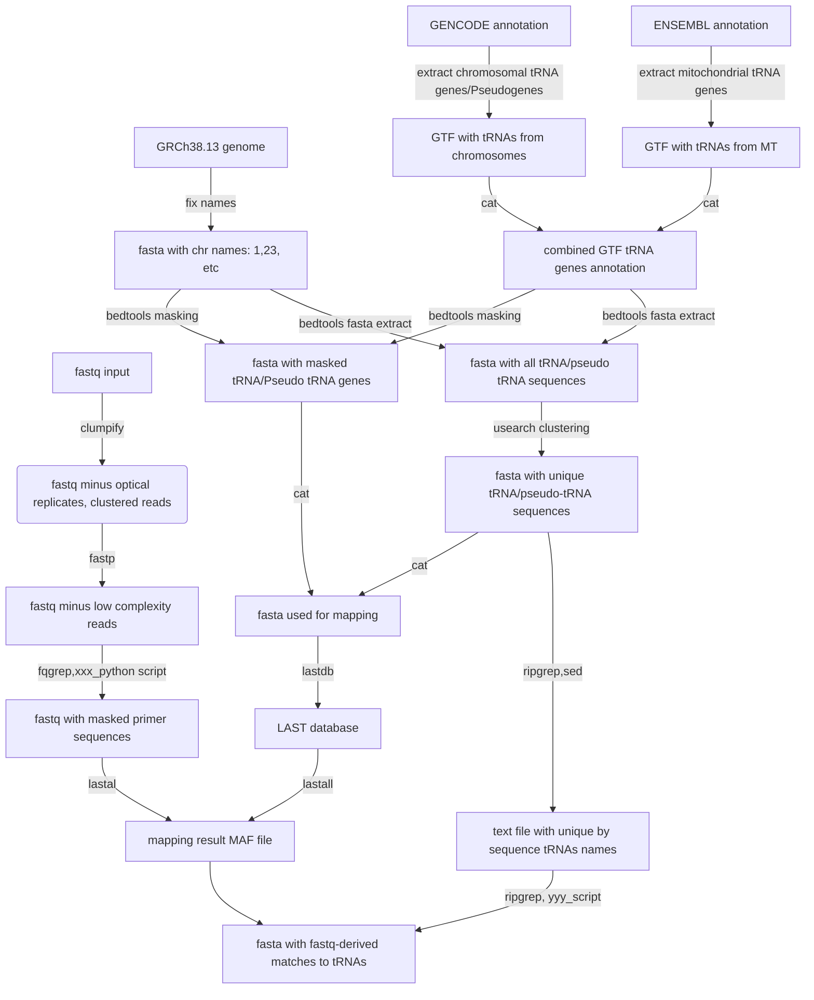

# bioinformatics workflow

```mermaid
graph TD
    A[fastq input] -->|clumpify| B(fastq minus optical replicates, clustered reads)
    B -->|fastp| C[fastq minus low complexity reads]
    C -->|fqgrep,xxx_python script| D[fastq with masked primer sequences]
    K[ GRCh38.13 genome] -->|fix names| fasta_names_fix[fasta with chr names: 1,23, etc]
    P[GENCODE annotation] -->|extract chromosomal tRNA genes/Pseudogenes| chromo_gtf[GTF with tRNAs from chromosomes]
    X[ENSEMBL annotation] -->|extract mitochondrial tRNA genes| mito_gtf[GTF with tRNAs from MT]
    chromo_gtf -->|cat|combo_gtf[combined GTF tRNA genes annotation]
    mito_gtf -->|cat|combo_gtf
    fasta_names_fix -->|bedtools masking|masked_genome[fasta with masked tRNA/Pseudo tRNA genes]
    combo_gtf -->|bedtools masking|masked_genome
    fasta_names_fix-->|bedtools fasta extract|trna_seq[fasta with all tRNA/pseudo tRNA sequences]
     combo_gtf -->|bedtools fasta extract|trna_seq
    trna_seq-->|usearch clustering|unique_trnas_seq[fasta with unique tRNA/pseudo-tRNA sequences]
    unique_trnas_seq-->|cat|genome_for_mapping[fasta used for mapping]
    masked_genome-->|cat|genome_for_mapping
    genome_for_mapping-->|lastdb|last_database[LAST database]
    D-->|lastal|maf_result[mapping result MAF file]
    last_database-->|lastall|maf_result
    unique_trnas_seq-->|ripgrep,sed|unique_trnas_seq_names[text file with unique by sequence tRNAs names]
    unique_trnas_seq_names-->|ripgrep, yyy_script|trna_matches_with_counts[fasta with fastq-derived matches to tRNAs] 
    maf_result-->trna_matches_with_counts
    
```