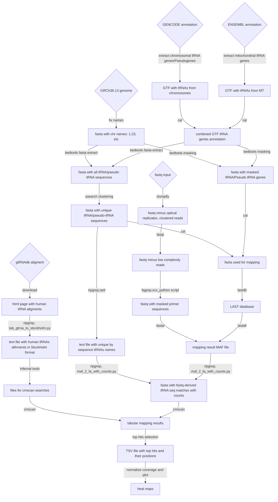

# bioinformatics workflow

```mermaid
graph TD

    genome_fasta{ GRCh38.13 genome} -->|fix names| fasta_names_fix[fasta with chr names: 1,23, etc]
    gencode_gtf{GENCODE annotation} -->|extract chromosomal tRNA genes/Pseudogenes| chromo_gtf[GTF with tRNAs from chromosomes]
    ensembl_gtf{ENSEMBL annotation} -->|extract mitochondrial tRNA genes| mito_gtf[GTF with tRNAs from MT]
    chromo_gtf -->|cat|combo_gtf[combined GTF tRNA genes annotation]
    mito_gtf -->|cat|combo_gtf
    fasta_names_fix -->|bedtools masking|masked_genome[fasta with masked tRNA/Pseudo tRNA genes]
    combo_gtf -->|bedtools masking|masked_genome
    fasta_names_fix-->|bedtools fasta extract|trna_seq[fasta with all tRNA/pseudo tRNA sequences]
    combo_gtf -->|bedtools fasta extract|trna_seq
    trna_seq-->|usearch clustering|unique_trnas_seq[fasta with unique tRNA/pseudo-tRNA sequences]
    unique_trnas_seq-->|cat|genome_for_mapping[fasta used for mapping]
    masked_genome-->|cat|genome_for_mapping
    genome_for_mapping-->|lastdb|last_database[LAST database]
    clumped_fastped_masked_fastq-->|lastal|maf_result[mapping result MAF file]
    last_database-->|lastall|maf_result
    unique_trnas_seq-->|ripgrep,sed|unique_trnas_seq_names[text file with unique by sequence tRNAs names]
    unique_trnas_seq_names-->|ripgrep, maf_2_fa_with_counts.py|trna_matches_with_counts[fasta with fastq-derived tRNA seq matches with counts] 
    maf_result-->|ripgrep, maf_2_fa_with_counts.py|trna_matches_with_counts
    gtRNAdb{gtRNAdb aligment}-->|download|html_aligment[html page with human tRNA aligments]
    html_aligment-->|ripgrep, tab_gtrna_to_stockholm.py|stockholm_align[text file with human tRNAs alihments in Stockholm format]
    stockholm_align-->|Infernal tools|cmscan_files[files for cmscan searches]
    cmscan_files-->|cmscan|cmscan_mapping_result[tabular mapping results]
    trna_matches_with_counts-->|cmscan|cmscan_mapping_result
    cmscan_mapping_result-->|top hits selection|cmscan_top_hits[TSV file with top hits and their positions]
    cmscan_top_hits-->|normalize coverage and plot|heat_maps[heat maps]
    fastq{fastq input} -->|clumpify| clumped_fastq(fastq minus optical replicates, clustered reads)
    clumped_fastq -->|fastp| clumped_fastped_fastq[fastq minus low complexity reads]
    clumped_fastped_fastq -->|fqgrep,xxx_python script|clumped_fastped_masked_fastq[fastq with masked primer sequences]
    
```